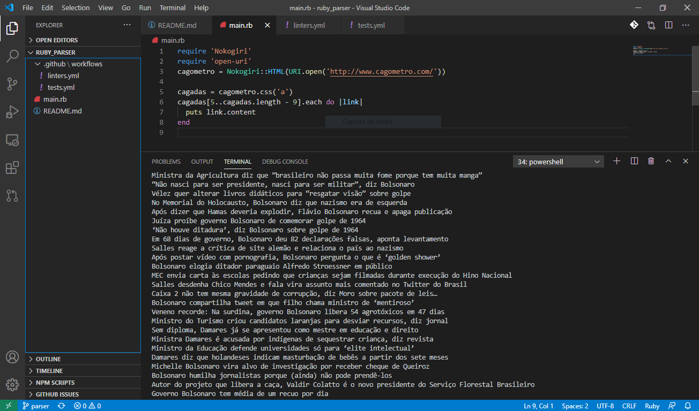

# Capstone Project (Ruby Scraper)

> This is my Capstone Project for the Ruby module of the Microverse course.
In this project, I was required to create a parser from any website available on the internet.
The choosen website was cagometro.com, a website dedicated to count the worst-mistakes (popularly called "cagadas" or, in english, "shits") done by Brazil's actual President Jair Bolsonaro.
Unfortunately, the lack of records after April 2020 surely means that the website is no longer being updated. 

## Built With

- Ruby

## Instructions for use

To check and use this project, please clone this repo into your local environment and run the file main.rb.
Please notice that you will need to use 'bundle install' to get the required gems for the project work on your environment.

## Author

👤 Luciano Sarno

- Github: [@lucianosarno](https://github.com/lucianosarno)
- Linkedin: [@ls-soares](https://www.linkedin.com/in/ls-soares/)
- Twitter: [@Luciano68238988](https://twitter.com/Luciano68238988)

## 🤝 Contributing

Contributions, issues, and feature requests are welcome!

Feel free to check the [issues page](issues/).

## Show your support

Give a ⭐️ if you like this project!

## Acknowledgments

- Microverse
- GitHub

## 📝 License

This project is open-licensed.

## 📝 Credits

This project uses information contained on cagometro.com website.
